# Calculator App
A very basic calculator application created with Java **Swing**. 

## Thank You!
Please ⭐️ this repo and share it with others

### Screenshots
Scientific / Dark |  Standard / Colored
:------------------:|:-------------------
 | 

### Requirements 🔧
* Java version 8 or higher.

### Installation 🔌
1. Press the **Fork** button (top right the page) to save copy of this project on your account.

2. Download the repository files (project) from the download section or clone this project by typing in the bash the following command:

       git clone https://github.com/HouariZegai/Calculator.git
3. Imported it in Intellij IDEA or any other Java IDE.
4. Run the application :D

### Contributing 💡
If you want to contribute to this project and make it better with new ideas, your pull request is very welcomed.
If you find any issue just put it in the repository issue section, thank you.

### Final Assignment
1. Setted up a file .yml to build the project 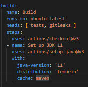
2. Added steps to execute sonar 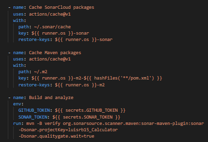
3. Added pom configuration for sonar 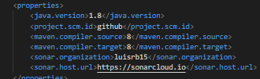 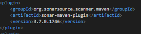
4. Added security tools 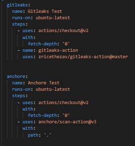
5. Added unit test step, requiring security so it runs in parallel 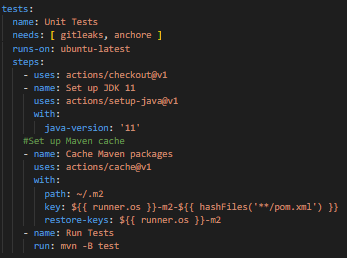
6. Added JFrog step 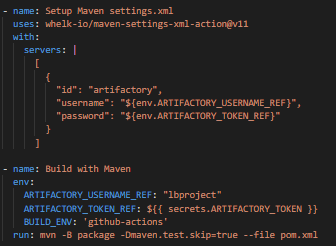
7. JFrog scm 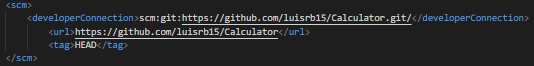
8. JFrog profile 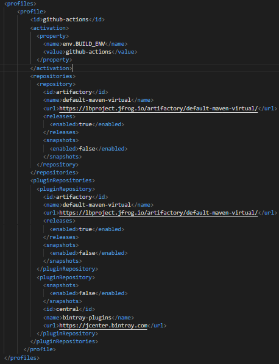
9. JFrog plugin 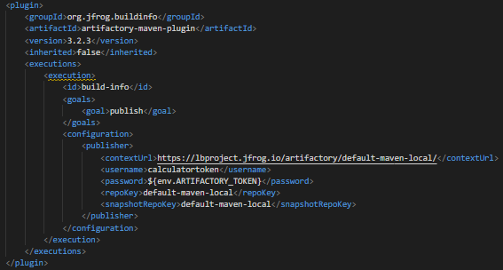

### Screenshots
SonarCloud
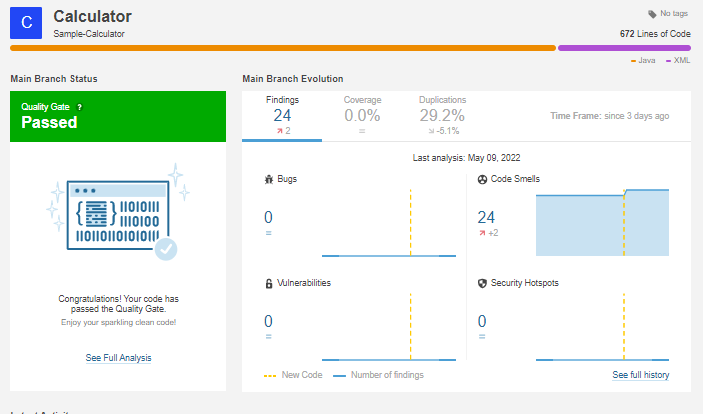
SonarCloud failing on CI
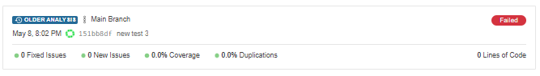
SonarCloud Quality Gate configuration to fail 
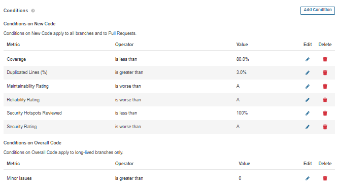
SonarCloud Quality Gate default configuration
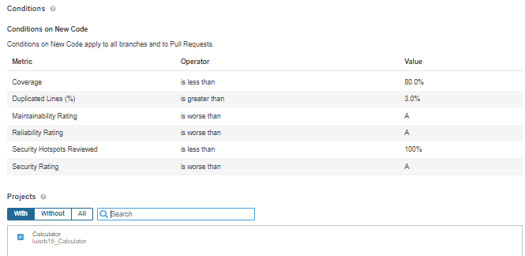
GitHub secrets added
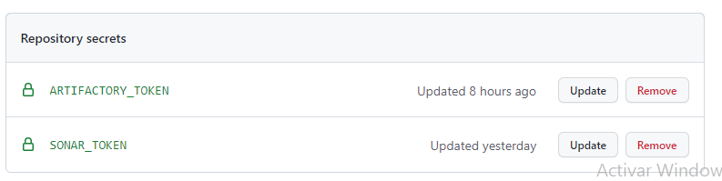
Jfrog settings added
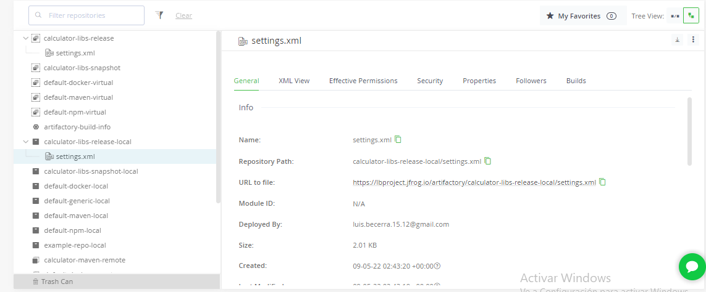